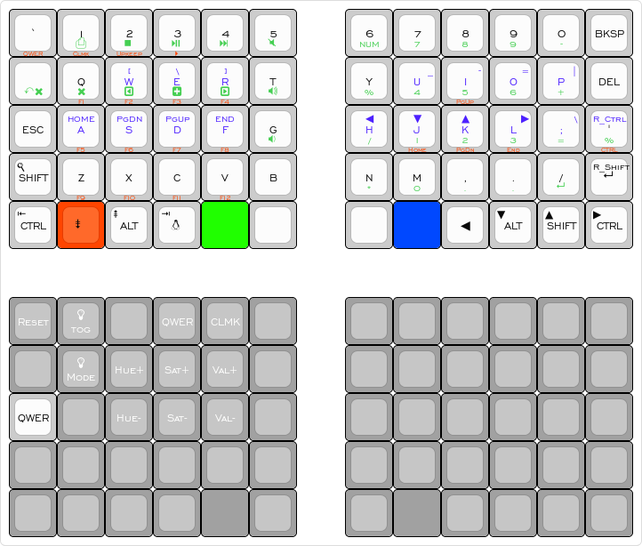

Super quick overiew

Base layer is QWERTY. Can be changed to Colemak or the "Upkeep/Maintenance" Layer
bottom mods have tap functionality for movement and hold for mods.

Lower is for math, music and manipulating tabs.
Left side is tabs and media. Right side is a numpad

Raise is for Movement and special characters.
Features mouse movement on the left side and arrows keys and special characters on the right.

Adjust is for switcing the defaults, Function Keys, and some other movement keys until I figure out how to allows Ctrl or Shift to modifer the Arrowkeys (Undecided if I'll do that or not)

Layout Image
Base Layer is Black.
Raise is blue
Lower is green
Adjust is orangered

Upkeep and Colemak are accessed by going to the Adjust layer then hitting the proper key.
Upkeep provides RGB controls, a reset button and the ability to switch the base layer.

[Permalink](http://www.keyboard-layout-editor.com/##@_backcolor=%23ffffff&name=Nyquist%20Experimental&author=James%20Firth&switchMount=cherry&switchBrand=cherry&switchType=MX1A-C1xx%3B&@_t=%23000000%0A%0A%0A%0A%23ff4500&p=DSA&a:7&fa@:4%3B%3B&=%60%0A%0A%0A%0AQWER&_t=%232500ff%0A%2300ab30%0A%0A%0A%23ff4500%0A%0A%23000000&a:5&fa@:4&:0&:0&:0&:0&:0&:4%3B%3B&=%0A%3Ci%20class%2F=%27kb%20kb-Unicode-PrintScreen-1%27%3E%3C%2F%2Fi%3E%0A%0A%0AClmk%0A%0A1&=%0A%3Ci%20class%2F=%27kb%20kb-Multimedia-Stop%27%3E%3C%2F%2Fi%3E%0A%0A%0AUpkeep%0A%0A2&_t=%232500ff%0A%2300ab30%0A%0A%0A%23ff4500&fa@:0&:0&:0&:0&:0&:0&:4%3B%3B&=%3Ci%20class%2F=%27fa%20fa-mouse-pointer%27%3E%3C%2F%2Fi%3EMid%0A%3Ci%20class%2F=%27kb%20kb-Multimedia-Play-Pause%27%3E%3C%2F%2Fi%3E%0A%0A%0A%3Ci%20class%2F=%27kb%20kb-Multimedia-Play%27%3E%3C%2F%2Fi%3E%0A%0A3&_t=%232500ff%0A%2300ab30%0A%0A%0A%0A%0A%23000000%3B&=%0A%3Ci%20class%2F=%27kb%20kb-Multimedia-FastForward-End%27%3E%3C%2F%2Fi%3E%0A%0A%0A%0A%0A4&=%0A%3Ci%20class%2F=%27kb%20kb-Multimedia-Mute-1%27%3E%3C%2F%2Fi%3E%0A%0A%0A%0A%0A5&_x:1%3B&=%0ANUM%0A%0A%0A%0A%0A6&=%0A7%0A%0A%0A%0A%0A7&=%0A8%0A%0A%0A%0A%0A8&=%0A9%0A%0A%0A%0A%0A9&=%0A-%0A%0A%0A%0A%0A0&_t=%23000000&a:7&fa@:4%3B%3B&=BKSP%3B&@_t=%232500ff%0A%2300ab30&a:5&fa@:4&:0&:0&:0&:0&:0&:4%3B%3B&=%0A%3Ci%20class%2F=%27kb%20kb-Undo-3%27%3E%3C%2F%2Fi%3E%3Ci%20class%2F=%27fa%20fa-times%27%3E%3C%2F%2Fi%3E%0A%0A%0A%0A%0ATab&_t=%232500ff%0A%2300ab30%0A%0A%0A%23ff4500&fa@:0&:0&:0&:0&:0&:0&:4%3B%3B&=WhlUp%0A%3Ci%20class%2F=%27fa%20fa-times%27%3E%3C%2F%2Fi%3E%0A%0A%0AF1%0A%0AQ&=%3Ci%20class%2F=%27fa%20fa-mouse-pointer%27%3E%3C%2F%2Fi%3ER%0A%3Ci%20class%2F=%27fa%20fa-caret-square-o-left%27%3E%3C%2F%2Fi%3E%0A%0A%0AF2%0A%0AW&=%3Ci%20class%2F=%27fa%20fa-mouse-pointer%27%3E%3C%2F%2Fi%3E%E2%96%B2%0A%3Ci%20class%2F=%27fa%20fa-plus-square%27%3E%3C%2F%2Fi%3E%0A%0A%0AF3%0A%0AE&=%3Ci%20class%2F=%27fa%20fa-mouse-pointer%27%3E%3C%2F%2Fi%3E%20L%0A%3Ci%20class%2F=%27fa%20fa-caret-square-o-right%27%3E%3C%2F%2Fi%3E%0A%0A%0AF4%0A%0AR&_t=%232500ff%0A%2300ab30%0A%0A%0A%0A%0A%23000000%3B&=%0A%3Ci%20class%2F=%27kb%20kb-Multimedia-Volume-Up-2%27%3E%3C%2F%2Fi%3E%0A%0A%0A%0A%0AT&_x:1%3B&=%0A%25%0A%0A%0A%0A%0AY&_t=%232500ff%0A%0A%0A%0A%0A%0A%0A%0A%0A%0A%2300ab30&a:4&fa@:0&:0&:0&:0&:0&:0&:4&:0&:0&:4%3B%3B&=%0A%0A-%0A%0A%0A%0A%0A%0A%0AU%0A4&_t=%232500ff%0A%0A%0A%0A%23ff4500%0A%0A%0A%0A%0A%0A%2300ab30%3B&=%0A%0A%E2%96%B2%0A%0APgUp%0A%0A%0A%0A%0AI%0A5&_t=%232500ff%0A%0A%0A%0A%0A%0A%0A%0A%0A%0A%2300ab30%3B&=%0A%0A%2F=%0A%0A%0A%0A%0A%0A%0AO%0A6&=%0A%0A%5C%0A%0A%0A%0A%0A%0A%0AP%0A+&_t=%23000000&a:7&fa@:4%3B%3B&=DEL%3B&@=ESC&_t=%232500ff%0A%0A%0A%0A%23ff4500&a:5&fa@:0&:0&:0&:0&:0&:0&:4%3B%3B&=WhlDn%0A%0A%0A%0AF5%0A%0AA&=%3Ci%20class%2F=%27fa%20fa-mouse-pointer%27%3E%3C%2F%2Fi%3E%E2%97%80%0A%0A%0A%0AF6%0A%0AS&=%3Ci%20class%2F=%27fa%20fa-mouse-pointer%27%3E%3C%2F%2Fi%3E%E2%96%BC%0A%0A%0A%0AF7%0A%0AD&=%3Ci%20class%2F=%27fa%20fa-mouse-pointer%27%3E%3C%2F%2Fi%3E%E2%96%B6%0A%0A%0A%0AF8%0A%0AF&_t=%232500ff%0A%2300ab30%0A%0A%0A%0A%0A%23000000%3B&=%0A%3Ci%20class%2F=%27kb%20kb-Multimedia-Volume-Down-2%27%3E%3C%2F%2Fi%3E%0A%0A%0A%0A%0AG&_x:1&t=%232500ff%0A%0A%0A%0A%0A%0A%0A%0A%0A%0A%2300ab30&a:4&fa@:0&:0&:0&:0&:0&:0&:4&:0&:0&:4%3B%3B&=%0A%0A%5B%0A%0A%0A%0A%0A%0A%0AH%0A%2F%2F&_t=%232500ff%0A%0A%0A%0A%23ff4500%0A%0A%0A%0A%0A%0A%2300ab30%3B&=%0A%0A%E2%97%80%0A%0AHome%0A%0A%0A%0A%0AJ%0A1&=%0A%0A%E2%96%BC%0A%0APgDn%0A%0A%0A%0A%0AK%0A2&=%0A%0A%E2%96%B6%0A%0AEnd%0A%0A%0A%0A%0AL%0A3&_t=%232500ff%0A%0A%0A%0A%0A%0A%0A%0A%0A%0A%2300ab30%3B&=%0A%0A%5D%0A%0A%0A%0A%0A%0A%0A%2F%3B%0A%2F=&_t=%23000000%0A%0A%232500ff%0A%0A%23ff4500%0A%0A%0A%0A%0A%0A%2300ab30%3B&=%0A%0AR%2F_Ctrl%0A%0ACTRL%0A%0A%0A%0A%0A%27%0A%25%3B&@_t=%23000000%3B&=%3Ci%20class%2F=%27kb%20kb-Search-1%27%3E%3C%2F%2Fi%3E%0A%0A%0A%0A%0A%0A%0A%0A%0ASHIFT&_t=%0A%0A%0A%0A%23ff4500&a:7&fa@:4%3B%3B&=Z%0A%0A%0A%0AF9&=X%0A%0A%0A%0AF10&=C%0A%0A%0A%0AF11&=V%0A%0A%0A%0AF12&_t=%23000000%3B&=B&_x:1&t=%232500ff%0A%2300ab30%0A%0A%0A%0A%0A%23000000&a:5&fa@:4&:0&:0&:0&:0&:0&:4%3B%3B&=%0A*%0A%0A%0A%0A%0AN&=%0A0%0A%0A%0A%0A%0AM&=%0A.%0A%0A%0A%0A%0A,&=%0A.%0A%0A%0A%0A%0A.&=%0A%3Ci%20class%2F=%27kb%20kb-Return-2%27%3E%3C%2F%2Fi%3E%0A%0A%0A%0A%0A%2F%2F&_t=%23000000&a:7%3B&=%3Ci%20class%2F=%27kb%20kb-Return-2%27%3E%3C%2F%2Fi%3E%3B&@_a:4&fa@:0&:0&:0&:0&:0&:0&:4&:0&:0&:4%3B%3B&=%3Ci%20class%2F=%27kb%20kb-Line-Start%27%3E%3C%2F%2Fi%3E%0A%0A%0A%0A%0A%0A%0A%0A%0ACTRL&_c=%23ff4500&a:7&fa@:4%3B%3B&=%3Ci%20class%2F=%27kb%20kb-Unicode-Page-Down-3%27%3E%3C%2F%2Fi%3E&_c=%23cccccc&a:4&fa@:0&:0&:0&:0&:0&:0&:0&:0&:0&:4%3B%3B&=%3Ci%20class%2F=%27kb%20kb-Unicode-Page-Up-3%27%3E%3C%2F%2Fi%3E%0A%0A%0A%0A%0A%0A%0A%0A%0AALT&=%3Ci%20class%2F=%27kb%20kb-Line-End%27%3E%3C%2F%2Fi%3E%0A%0A%0A%0A%0A%0A%0A%0A%0A%3Ci%20class%2F=%27kb%20kb-logo-linux-tux%27%3E%3C%2F%2Fi%3E&_c=%2320ff00&g:true&fa@:4%3B%3B&=LWR&_c=%23cccccc&g:false&a:7%3B&=&_x:1%3B&=&_c=%230048ff&t=%23ffffff&g:true%3B&=%3Ci%20class%2F=%27fa%20fa-angle-double-up%27%3E%3C%2F%2Fi%3E&_c=%23ff4500&t=%23000000&g:false%3B&=%E2%97%80&_c=%23cccccc&a:4&fa@:0&:0&:0&:0&:0&:0&:0&:0&:0&:4%3B%3B&=%E2%96%BC%0A%0A%0A%0A%0A%0A%0A%0A%0AALT&=%E2%96%B2%0A%0A%0A%0A%0A%0A%0A%0A%0ASHIFT&=%E2%96%B6%0A%0A%0A%0A%0A%0A%0A%0A%0ACTRL%3B&@_y:1&c=%23a1a1a1&t=%23ffffff&a:7&fa@:4%3B%3B&=Reset&=%3Ci%20class%2F=%27fa%20fa-lightbulb-o%27%3E%3C%2F%2Fi%3E%3Cbr%3Etog&=&=QWER&=CLMK&=&_x:1%3B&=&=&=&=&=&=%3B&@=&=%3Ci%20class%2F=%27fa%20fa-lightbulb-o%27%3E%3C%2F%2Fi%3E%3Cbr%3EMode&=Hue+&=Sat+&=Val+&=&_x:1%3B&=&=&=&=&=&=%3B&@_c=%23cccccc&t=%23000000%3B&=QWER&_c=%23a1a1a1&t=%23ffffff%3B&=&=Hue-&=Sat-&=Val-&=&_x:1%3B&=&=&=&=&=&=%3B&@=&=&=&=&=&=&_x:1%3B&=&=&=&=&=&=%3B&@=&=&=&=&_g:true%3B&=&_g:false%3B&=&_x:1%3B&=&_g:true%3B&=&_g:false%3B&=&=&=&=)
